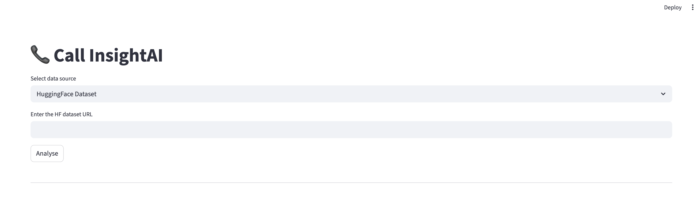
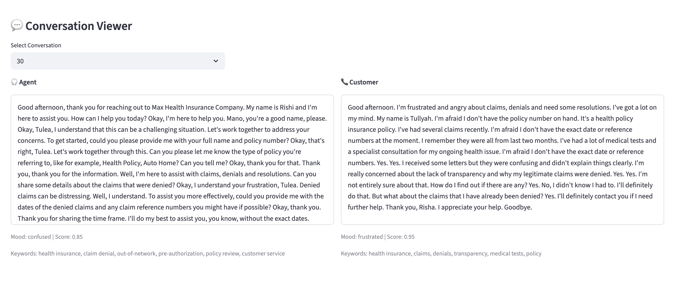
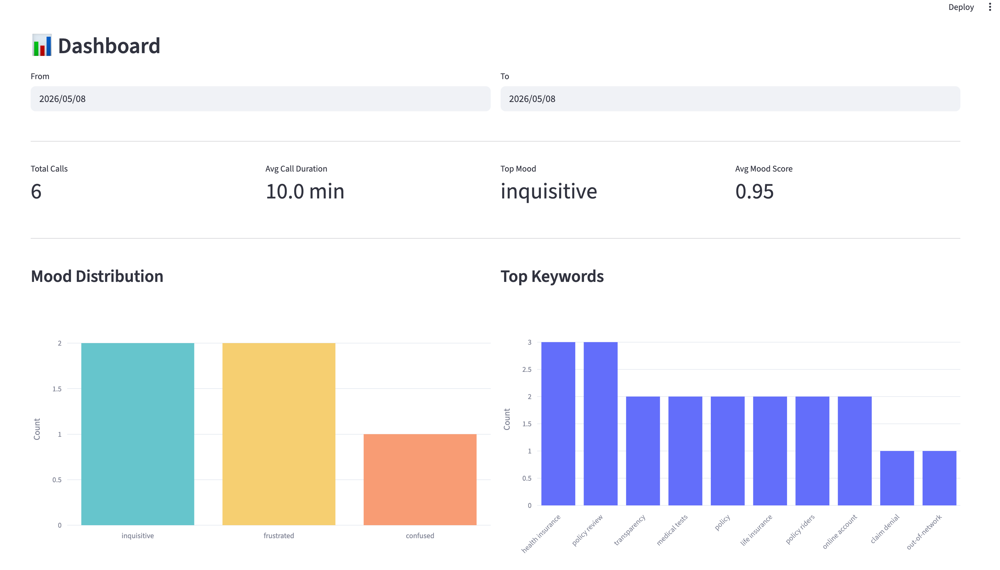

# Call InsightAI

An end-to-end call centre analytics dashboard that transcribes, 
classifies and analyses call recordings using AI.

## Features
- Audio transcription using OpenAI Whisper
- Speaker classification (agent vs customer)
- Mood and keyword analysis using Gemini API
- Interactive Streamlit dashboard

## Tech Stack
- Streamlit, SQLite/SQLAlchemy
- OpenAI Whisper, HuggingFace Transformers
- Google Gemini API, Plotly
- librosa, soundfile, ffmpeg

## Setup
1. Clone the repo
2. Create conda environment:
   conda env create -f environment.yml
3. Add GEMINI_API_KEY to .env file:
   GEMINI_API_KEY=your_key_here
4. Run the app:
   streamlit run app.py

## Screenshots

## Known Limitations
- Speaker classifier accuracy depends on call opening phrases
- Gemini API as per your plan
- Transcription and Speaker Classification is done locally. Only analysis is done on cloud